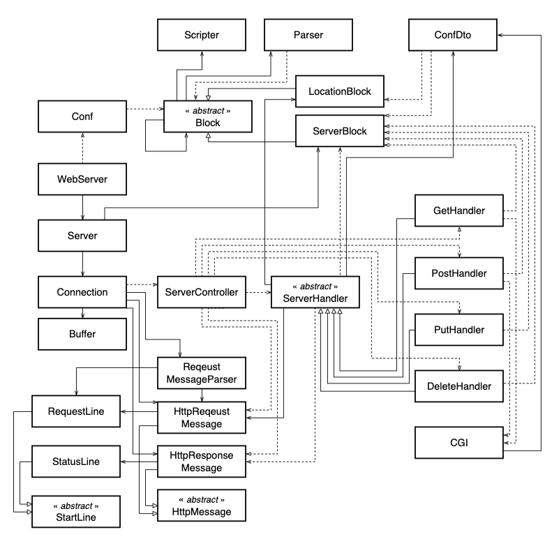
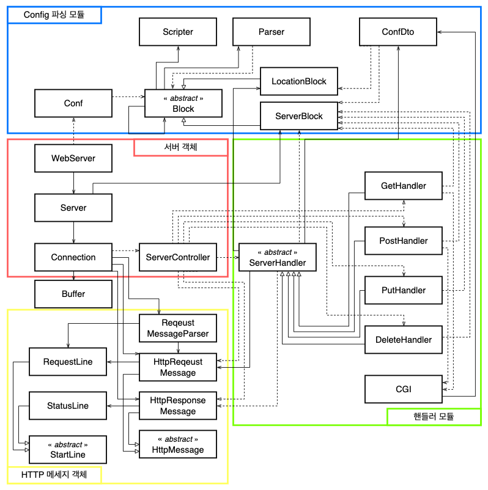
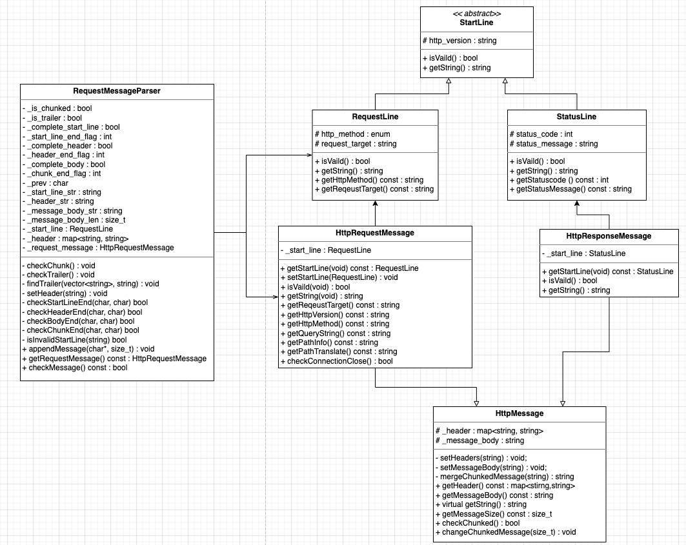

# **클래스 다이어그램**
**[[메인화면으로 가기]](https://github.com/wkdtpgns5016/webserve)**

## **개요**
> <webserv 클래스다이어그램 연관 관계>
> 
> 

**1. Server 객체**  
> 

**2. Configuration 모듈**  
> 

**3. Request Handler 모듈**  
> 

**4. HttpMessage 객체**  
> 
